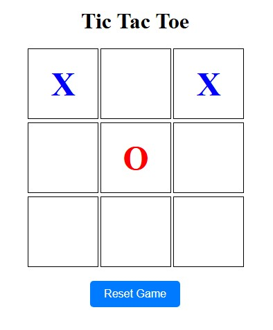

# Tic Tac Toe Game 🎮

Tic Tac Toe adalah permainan klasik yang dimainkan oleh dua pemain. Pemain bergiliran menandai sel dalam grid 3x3 dengan simbol X atau O. Pemain yang berhasil menempatkan tiga simbol mereka dalam satu baris, kolom, atau diagonal terlebih dahulu akan menang. 🏆

<p align="center">
  
</p>

## Fitur ✨

- Dua pemain dapat bermain secara bergiliran. 👥
- Simbol X berwarna biru dan simbol O berwarna merah (untuk versi web). 🔵🔴
- Menampilkan pesan ketika ada pemenang atau jika permainan berakhir seri. 📢
- Tombol untuk mereset permainan (untuk versi web). 🔄
- Versi CLI yang dapat dimainkan di terminal. 💻

## Teknologi yang Digunakan 🛠️

- HTML
- CSS
- JavaScript
- Node.js (untuk versi CLI)

## Cara Menjalankan 🚀

### Versi Web 🌐

1. **Clone repositori ini**:
   ```bash
   git clone https://github.com/Sulqwerty/Tic-Tac-Toe
   ```

2. **Buka file `tic_tac_toe.html`** di browser Anda:
   - Anda dapat membuka file ini langsung di browser dengan mengklik dua kali pada file `tic_tac_toe.html`.

### Versi CLI 🖥️

1. **Pastikan Anda memiliki Node.js terinstal** di komputer Anda. Anda dapat mengunduhnya dari [situs resmi Node.js](https://nodejs.org/).

2. **Clone repositori ini** (jika belum):
   ```bash
   git clone https://github.com/Sulqwerty/Tic-Tac-Toe
   ```

3. **Navigasi ke direktori proyek**:
   ```bash
   cd repo-name
   ```

4. **Jalankan permainan menggunakan Node.js**:
   ```bash
   node tic_tac_toe-cli.js
   ```


## Cara Bermain 🎉

- Untuk versi web, klik pada sel yang ingin Anda tandai dengan simbol X atau O. 🖱️
- Untuk versi CLI, ikuti instruksi yang ditampilkan di terminal:
  - Masukkan nomor baris dan kolom (1-3) untuk menandai sel dengan simbol Anda.
  misalnya: 1 1 (baris 1, kolom 1)
  - Giliran akan berganti antara pemain X dan O.
  - Permainan akan berakhir ketika ada pemenang atau jika semua sel terisi (seri).

## Struktur Proyek 📁

- `tic_tac_toe.html`: File HTML yang berisi struktur dan logika permainan untuk versi web.
- `tic_tac_toe-cli.js`: File JavaScript untuk logika permainan versi CLI.HTML).

## Keterangan 📜

- Terinspirasi dari permainan Sudoku klasik project https://github.com/carlini/printf-tac-toe
- UI/UX design terinspirasi dari berbagai implementasi Tic Tac Toe modern
